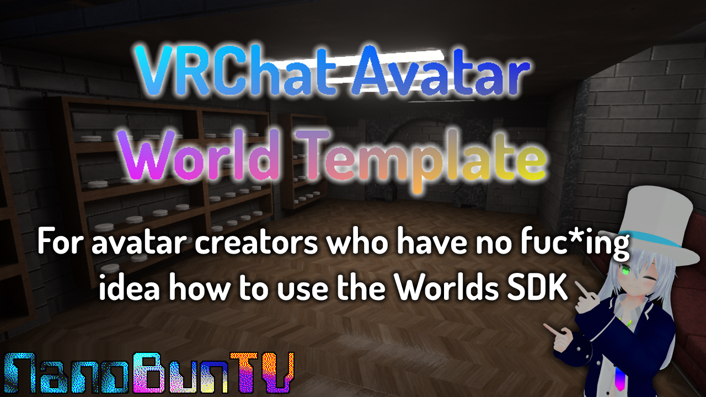

### [🟢 Download the Latest Release 🟢](https://github.com/NanoBunTV/VRC-Avatar-World-Template/releases/latest)

 

# Avatar World Template
### Created by [NanoBunTV](https://nanobun.tv)

A rework of the VRChat Home Kit package for use as a VRChat Avatar World, to help give a base for Avatar creators to build from and create their own Avatar world.

Many Avatar creators have no clue how to use the Worlds SDK, that is exactly why I put together this package.

⚠ **If you fail to thoroughly read the [documentation](https://docs.google.com/document/d/1YzfKZK9B7GKWLM5A1B7Nnoy11o_L3tRnlCxwWN6iFpM/edit?usp=sharing) and something goes wrong, I will laugh at you.** ⚠

If you require further assistance, open a support ticket through my [Discord server](https://nanobun.tv/discord).

This package is also available on [booth.pm](https://nanobuntv.booth.pm/items/5397881) and [gumroad](https://nanobuntv.gumroad.com/l/vrc-avatar-world-template)

[Also this nerd gave me the idea.](https://twitter.com/WitchyOak320)

## License
This work is licensed under a **[Creative Commons Attribution-NonCommercial-ShareAlike 4.0 International License](https://creativecommons.org/licenses/by-nc-sa/4.0/)**.

Some assets included within this package may fall under different licensing, please read the **LICENSE.txt** file for exceptions.
